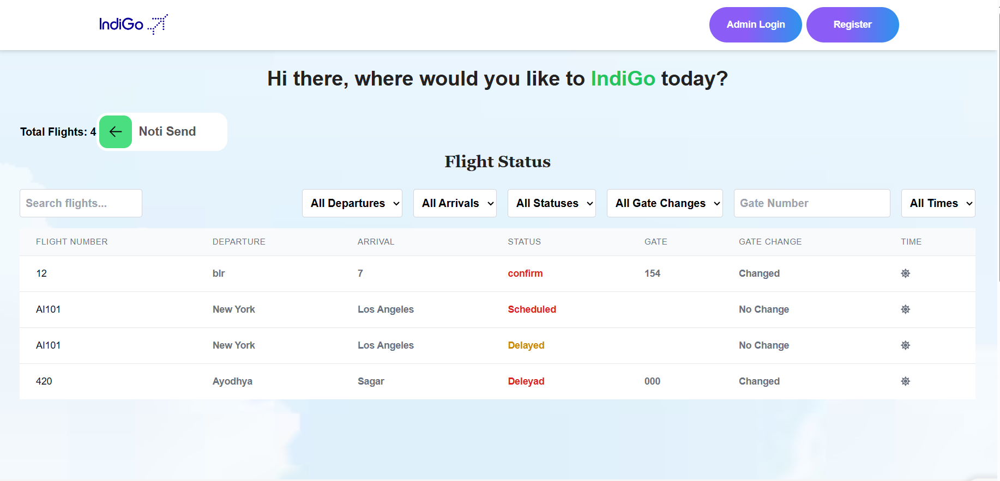

## Project Overview

IndiGoHack is a web application designed to manage flight notifications. The application allows users to set their notification preferences for flight updates via SMS and email. The project is divided into two main parts: the frontend and the backend.

## Tech Stack

### Frontend
- **React**: A JavaScript library for building user interfaces.
- **Tailwind CSS**: A utility-first CSS framework for styling.
- **Jest**: A testing framework for JavaScript.

### Backend
- **Node.js**: A JavaScript runtime built on Chrome's V8 JavaScript engine.
- **Express**: A minimal and flexible Node.js web application framework.
- **MongoDB**: A NoSQL database for storing application data.
- **Mongoose**: An ODM (Object Data Modeling) library for MongoDB and Node.js.
- **Nodemailer**: A module for Node.js applications to send emails.
- **Twilio**: A cloud communications platform for sending SMS notifications.
- **JSON Web Token (JWT)**: A compact, URL-safe means of representing claims to be transferred between two parties.

## Features

### Admin Login
- **File**: 
- **Description**: Allows admin users to log in using their email and password. Upon successful login, the user is redirected to the admin dashboard.



### Flight Management
- **File**: 
- **Description**: Admins can update flight details such as flight number, departure, arrival, date, status, and current status (delay, cancellation, gate change, gate number, landing time).


### Flight Status
- **File**: 
- **Description**: Displays the status of all flights with filtering options for flight number, departure, arrival, status, gate change, gate number, and time of day (morning, evening, night).


### Flight Table
- **File**: 
- **Description**: Renders a table of flight information.


### Add New Flight
- **File**: 
- **Description**: Admins can add new flights with details such as flight number, departure, arrival, date, status, and current status.

### Layout and Footer
- **Files**: 
- **Description**: Provides a consistent layout and footer for the application.

### Admin Dashboard
- **File**:
- **Description**: Admin dashboard with navigation to different sections like home, all notify users, flight status, all flights, and add flights.


### Notification Management
- **File**:
- **Description**: Mongoose schema for storing notification preferences of users.

### Flight Controller
- **File**:
- **Description**: Contains functions for handling flight-related operations like fetching flight details by ID.

## Directory Structure

### Frontend

The `/frontend` directory contains the source code for the React-based web application.

- **public/**: Contains static files.
- **src/**: Contains the source code for the application.
  - **components/**: Various React components used in the frontend.
  - **pages/**: Contains `About.js` and `Home.js` which render different pages of the web application.
  - **App.js**: The main App component.
  - **App.test.js**: Contains test cases for the App component.
  - **index.css**: CSS file for styling the frontend.
  - **setupTests.js**: Imports `@testing-library/jest-dom` for custom Jest matchers.

### Backend

The `/backend` directory contains the source code for the Node.js backend application.

- **config/**: Contains `nodemailer.js` for configuring Nodemailer with SendGrid.
- **controller/**: Contains functions for handling different aspects of the application.
- **database/**: Contains `db.js` for connecting to MongoDB using Mongoose.
- **middleware/**: Contains `authMiddleware.js` for JWT authentication.
- **models/**: Defines Mongoose schemas and models.
- **routes/**: Defines Express routers for handling HTTP requests.
- **scripts/**: Contains `admin.js` with a warning comment.
- **server.js**: The main server file for the application.
- **utils/**: Contains `notify.js` for sending email notifications.


## Installation and Setup

### Frontend

1. Navigate to the `/frontend` directory.
2. Install dependencies:
   ```bash
   npm install

### Backend

1. avigate to the /backend directory.
2. Install dependencies:
  ```bash

npm install


Create a .env file and add the following environment variables:

MONGODB_URI=your_mongodb_uri
JWT_SECRET=your_jwt_secret
SENDGRID_API_KEY=your_sendgrid_api_key
TWILIO_ACCOUNT_SID=your_twilio_account_sid
TWILIO_AUTH_TOKEN=your_twilio_auth_token
TWILIO_PHONE_NUMBER=your_twilio_phone_number

## Additional Tools and Libraries
dotenv: For loading environment variables from a .env file.
cors: For enabling Cross-Origin Resource Sharing.
body-parser: For parsing incoming request bodies.